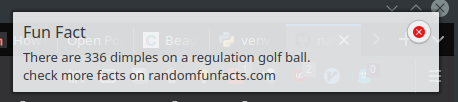

# fun_facts

A simple script to diplay [fun facts](http://randomfunfacts.com/) as a notification popup inspired from [here](https://blog.ashfame.com/2011/04/ubuntu-notification-system/). It works only on Ubuntu exploiting the `notify-send` function. I added a timer to it so that it displays a random fun fact at a certain interval.


Here's a screenshot:




## setup

- install `libnotify-bin` if you haven't yet using `apt-get`


```
$ python3 -m venv env_name  # create venv
$ source env_name/bin/activate
$ pip install -r requirements.txt
$ python fun_facts.py
```

*NOTE* - be sure to add your env name to `.gitignore` file... default is `funfacts_env`
- Adjust your display and frequency interval in the script
- Add it to your startup shell to start it in background at login time
  - E.g., add this to your `.bashrc/.zshrc` -

    ```echo "/path/to/env_name/bin/python /path/to/fun_facts.py &" >> ~/.bashrc```
